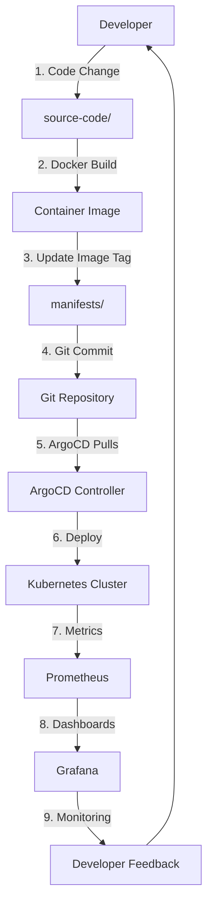

# 🏗️ Arquitectura GitOps - Diseño del Sistema

## 🎯 **Principios de Diseño**

Este proyecto implementa **GitOps puro** siguiendo los principios fundamentales:

### **1. 📦 Declarative**
- Todo el estado deseado está definido en Git como código YAML
- No hay configuración imperativa (kubectl apply manual)
- El cluster siempre converge al estado definido en Git

### **2. 🔄 Versioned & Immutable**
- Cada cambio pasa por Git (history + rollbacks)
- Deployments inmutables vía container images
- Audit trail completo de todos los cambios

### **3. 🚀 Pulled Automatically**
- ArgoCD monitorea Git y aplica cambios automáticamente
- No hay push desde CI/CD al cluster
- El cluster "pull" los cambios del repositorio

### **4. 🔍 Continuously Monitored**
- ArgoCD verifica continuamente el estado actual vs deseado
- Self-healing automático cuando hay drift
- Alertas cuando el cluster está fuera de sincronización

---

## 🏗️ **Separación por Capas**

### **Capa 1: 🔧 Sistema Base** (`setup/`)
**Responsabilidad**: Preparar el entorno de trabajo
- Herramientas del sistema (git, docker, kubectl, kind)
- Shell y productividad (zsh, aliases)
- Sin lógica GitOps

### **Capa 2: 🏭 Infraestructura** (`setup/install-cluster.sh`)
**Responsabilidad**: Cluster Kubernetes + ArgoCD básico
- Cluster kind local
- ArgoCD controller instalado
- Configuración mínima de acceso

### **Capa 3: 🚀 GitOps Logic** (`gitops/`)
**Responsabilidad**: Configuración GitOps completa
- Projects y RBAC de ArgoCD
- Repository secrets para Git
- Applications definitions
- App-of-Apps pattern

### **Capa 4: 📦 Workloads** (`manifests/`)
**Responsabilidad**: Aplicaciones y servicios
- Kubernetes manifests organizados por función
- Separación infrastructure vs applications
- Configuración específica de cada servicio

### **Capa 5: 💻 Source Code** (`source-code/`)
**Responsabilidad**: Código de aplicaciones
- Código fuente puro (Go, Dockerfile)
- Sin manifests Kubernetes
- Developer workflow independiente

---

## 🔄 **Flujo GitOps Completo**



### **📋 Flujo Paso a Paso:**

1. **👨‍💻 Developer** modifica código en `source-code/hello-world-modern/`
2. **🐳 Build** de nueva imagen Docker con tag actualizado
3. **📦 Update** del image tag en `manifests/applications/hello-world/deployment.yaml`  
4. **📝 Commit** del cambio al repositorio Git
5. **🔍 ArgoCD** detecta el cambio automáticamente (polling o webhook)
6. **🚀 Deploy** automático al cluster Kubernetes
7. **📊 Prometheus** recolecta métricas de la nueva versión
8. **📈 Grafana** muestra dashboards actualizados
9. **🔔 Feedback** al developer via métricas/logs/alerts

---

## 🏭 **Patrones Implementados**

### **1. App-of-Apps Pattern**
```yaml
# gitops/bootstrap/app-of-apps.yaml
# Una aplicación que gestiona otras aplicaciones
bootstrap-infrastructure → dashboard + prometheus + grafana
bootstrap-applications  → hello-world + future-apps
```

**Beneficios:**
- Gestión jerárquica de aplicaciones
- Bootstrap automático de todo el stack
- Fácil onboarding de nuevas aplicaciones

### **2. Repository Per Environment**
```
infrastructure.git  → Herramientas compartidas (Prometheus, Grafana)
applications.git    → Apps de negocio (Hello World)  
bootstrap.git       → ArgoCD configuration
```

**Beneficios:**
- Separación de responsabilidades
- RBAC granular por tipo de workload
- Ciclos de release independientes

### **3. Manifest Organization**
```
manifests/infrastructure/  → Platform tools (shared)
manifests/applications/    → Business workloads (team-owned)
```

**Beneficios:**
- Ownership claro por equipos
- Políticas de deployment diferentes
- Escalabilidad organizacional

---

## 🔒 **Modelo de Seguridad**

### **ArgoCD Projects Separation**

#### **Project: infrastructure**
- **Scope**: Herramientas de platform (Prometheus, Grafana, Dashboard)
- **Permissions**: Cluster-wide resources, monitoring namespaces
- **Users**: Platform team, SREs

#### **Project: applications**  
- **Scope**: Business applications (Hello World, future apps)
- **Permissions**: Application namespaces only
- **Users**: Development teams

### **RBAC Matrix**
| Resource | Infrastructure Project | Applications Project |
|----------|----------------------|---------------------|
| Namespaces | monitoring, kubernetes-dashboard | hello-world, app-* |
| ClusterRoles | ✅ Full access | ❌ Limited |
| PVs/Storage | ✅ Can create | ✅ Can create |
| Network Policies | ✅ Can manage | ❌ Read-only |
| CRDs | ✅ Can install | ❌ Use only |

---

## 📊 **Observability Architecture**

### **Metrics Flow**
```
Applications → /metrics endpoint → Prometheus → Grafana
    ↓              ↓                    ↓           ↓
hello-world    HTTP scrape         Storage    Dashboards
kubernetes     Service discovery   Queries    Alerts
```

### **Prometheus Configuration**
- **Service Discovery**: Automatic pod/service discovery
- **Scrape Configs**: Applications with `prometheus.io/scrape: "true"`
- **Storage**: Local storage (sufficient for learning)
- **Retention**: 15 days default

### **Grafana Setup**
- **Datasource**: Prometheus auto-configured
- **Dashboards**: Basic templates included
- **Access**: Admin user (admin/admin123)
- **Plugins**: Core plugins only (minimal)

---

## 🔧 **Technical Decisions**

### **Why kind vs minikube/k3s?**
- ✅ Real Kubernetes (not custom distro)
- ✅ Multi-node support (if needed)
- ✅ Excellent Docker integration
- ✅ Active maintenance and community

### **Why ArgoCD vs Flux/Jenkins X?**
- ✅ Best-in-class UI for learning
- ✅ Powerful RBAC and multi-tenancy
- ✅ App-of-Apps pattern support
- ✅ Huge community and enterprise adoption

### **Why Gitea vs GitHub/GitLab?**
- ✅ Self-hosted (no external dependencies)
- ✅ Lightweight and fast
- ✅ Git-compatible (can migrate easily)
- ✅ Perfect for local development

### **Why Prometheus/Grafana vs ELK/DataDog?**
- ✅ Cloud-native standard
- ✅ Pull-based metrics (GitOps aligned)
- ✅ Excellent Kubernetes integration
- ✅ Free and open source

---

## 🚀 **Scaling Considerations**

### **Multi-Team Setup**
```
gitops/projects/
├── team-platform.yaml     # Infrastructure tools
├── team-frontend.yaml     # Frontend applications  
├── team-backend.yaml      # Backend services
└── team-data.yaml         # Data processing apps
```

### **Multi-Environment**
```
gitops/applications/
├── dev/           # Development applications
├── staging/       # Staging applications  
└── prod/          # Production applications
```

### **Multi-Region**
```
config/
├── kind-config.yaml       # Local development
├── aws-eks-config.yaml    # AWS production
└── gcp-gke-config.yaml    # GCP staging
```

---

## 🎯 **Next Steps for Production**

### **Security Hardening**
- [ ] Replace admin/admin123 with proper auth (OIDC/LDAP)
- [ ] Enable TLS everywhere (cert-manager + Let's Encrypt)
- [ ] Implement Network Policies
- [ ] Add Pod Security Standards
- [ ] Secrets management (Sealed Secrets/External Secrets)

### **Observability Enhancement**
- [ ] Add Jaeger for distributed tracing
- [ ] Implement structured logging (EFK stack)
- [ ] Add AlertManager for Prometheus alerts
- [ ] Custom Grafana dashboards per team
- [ ] SLI/SLO monitoring

### **GitOps Maturity**
- [ ] Multi-environment promotion pipelines
- [ ] Automated testing in ArgoCD (conftest/OPA)
- [ ] Progressive delivery (Argo Rollouts)
- [ ] Image scanning and security policies
- [ ] Disaster recovery procedures

### **Platform Engineering**
- [ ] Self-service application onboarding
- [ ] Template-based application scaffolding  
- [ ] Developer portal integration
- [ ] Cost monitoring and optimization
- [ ] Compliance and audit reporting

---

**🎓 Este diseño balanza simplicidad educativa con patterns escalables a producción real.**